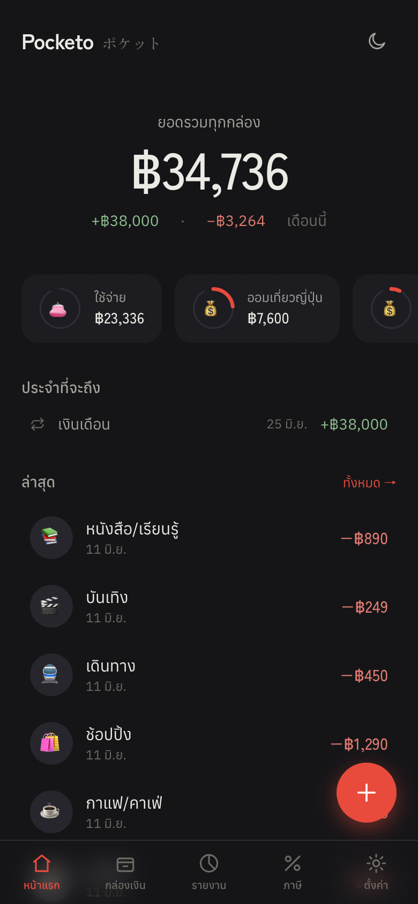
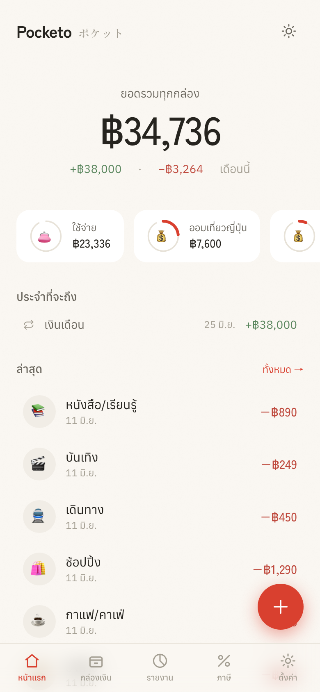
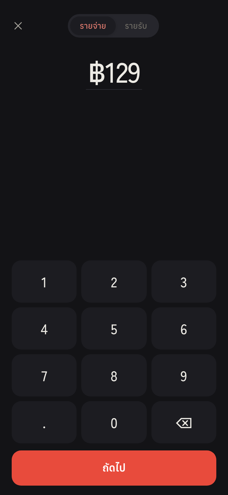
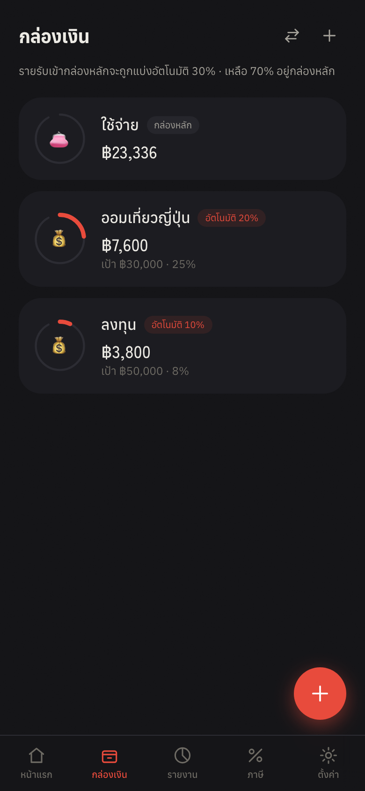
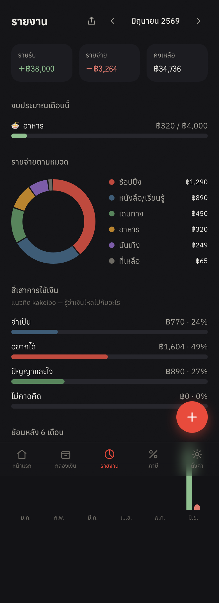
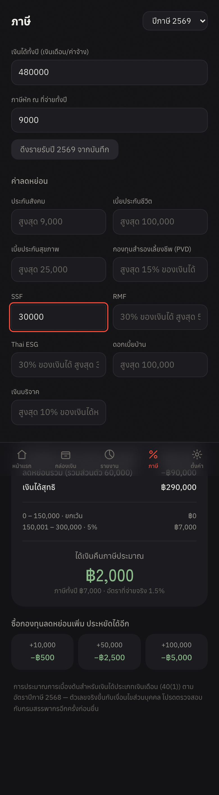
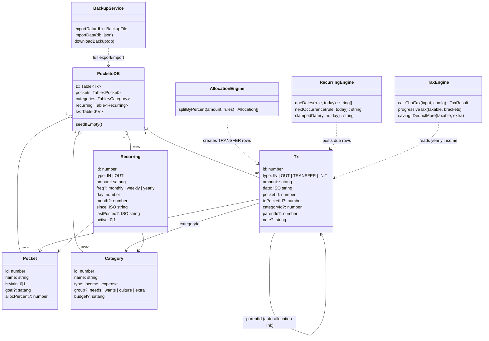

# Pocketo（ポケット）— Project Description

> Technical/usage documentation lives in [README.md](README.md). This document covers the project itself: the idea, the design, the architecture, and the data.

---

## 1. Project Overview

- **Project Name:** Pocketo（ポケット）
- **Live App:** https://tasachii.github.io/pocketo/
- **Repository:** https://github.com/Tasachii/pocketo

**Brief Description**

Pocketo is a minimal, Japanese-inspired income & expense tracker built as an installable Progressive Web App (PWA). It is a digital take on *kakeibo* (家計簿), the Japanese household account book method practiced since 1904 — the point is not just recording numbers, but spending mindfully. Logging one transaction takes three taps; income can be split automatically into "pockets" (savings, investing, travel funds) the moment it arrives, and the app can estimate Thai personal income tax from the income you actually logged.

Everything runs in the browser and every byte of data stays on the user's device (IndexedDB). There is no server, no account, no analytics, and the app works fully offline after the first load.

**Problem Statement**

Most personal finance apps are bloated, require sign-up, sync financial data to someone else's server, and treat saving goals and tax planning as separate paid features. Thai users in particular have no lightweight tool that combines: a fast expense journal, pocket-based money allocation (popularized by MAKE by KBank), and a Thai personal income tax estimator — without giving up privacy.

**Target Users**

- Thai individuals who want a fast, private daily money journal
- People who budget with the envelope/pocket method and want automatic income splitting
- Salaried earners who want a quick estimate of yearly tax and how much SSF/RMF/Thai ESG purchases would save them

**Key Features**

- 3-tap expense logging (amount → next → tap a category, saved instantly)
- Pockets with automatic %-based income allocation, transfer between pockets, and saving goals drawn as an *ensō* ink-circle progress ring
- Kakeibo reports: expenses grouped under the four classic pillars — Needs / Wants / Culture / Unexpected — plus a category donut and a 6-month trend
- Monthly budgets per category with green → amber → red progress bars
- Recurring transactions (weekly / monthly / yearly) with catch-up posting for months the app wasn't opened
- Thai personal income tax estimator: 8 progressive brackets, standard 50% expense deduction, allowance caps (SSF, RMF, Thai ESG, PVD, insurance, social security, home-loan interest, donations), withholding-tax refund, and a "buy X more, save Y" simulator
- Full transaction history with search, filters, editing, and undo-able deletes
- JSON export / import backup with a 30-day reminder banner
- Shareable monthly summary card rendered to a 1080×1350 PNG
- Dark / light / system themes; installable PWA; 100% offline

**Screenshots**

| Home (dark) | Home (light) | Quick add |
|---|---|---|
|  |  |  |

| Pockets | Reports | Tax estimator |
|---|---|---|
|  |  |  |

---

## 2. Concept

### 2.1 Background

The project started from studying existing open-source finance apps (Actual Budget, Firefly III, Maybe Finance, and several Thai trackers) and two observations:

1. The apps people actually keep using are the ones where logging is nearly frictionless — and the ones that feel calm rather than dashboard-noisy. Japanese minimalism (*Ma* — purposeful negative space, *Kanso* — simplicity by removing the non-essential) is a natural design language for that.
2. No lightweight app combines the three things a Thai user needs in one place: a money journal, MAKE-style pockets, and Thai tax math.

Kakeibo supplies the philosophy: classify spending into Needs, Wants, Culture, and Unexpected, look at the result monthly, and adjust. Pocketo implements that loop digitally.

### 2.2 Objectives

- Make recording a transaction fast enough to do every time (≤ 3 taps)
- Let users allocate income automatically into purpose-driven pockets and track goals
- Give an honest, bracket-by-bracket estimate of Thai personal income tax with a savings simulator
- Keep all financial data on-device: no server, no account, exportable at any time
- Stay genuinely minimal: small bundle (< 100 KB gzip JS), no chart library, no UI framework beyond React + Tailwind

---

## 3. Architecture

The app is a static, local-first PWA. There is no backend; the "database" is IndexedDB in the user's browser, accessed through Dexie.

```
React UI (screens + components)
   │  useLiveQuery (reactive reads)
   ▼
db/data.ts  ── application services: saveQuickTx, calcBalances,
   │           deleteTxCascade/restoreTxs, updateTx, applyDueRecurring, transfer
   ▼
PocketoDB (Dexie) ── IndexedDB, schema v1 → v2 with versioned migrations
   ▲
core/* ── pure engines, no I/O, fully unit-tested:
          money · allocate · tax · recurring · backup · share
```

### Class / Entity Diagram



### Key architectural decisions

- **Money is stored as integer satang.** Floating-point baht would drift (`0.1 + 0.2 ≠ 0.3`); integers can't.
- **Pocket balances are never stored.** They are always derived by folding the transaction log (`calcBalances`), so a balance can never desync from its history.
- **Auto-allocation is linked, not implicit.** When income enters the main pocket, generated TRANSFER rows carry a `parentId` back to the income row — so editing the income re-splits them and deleting it cascades (with undo restoring the whole set).
- **All correctness-critical logic is a pure function** under `src/core/` with no I/O, which is what makes the 70+ unit tests cheap and trustworthy.
- **Tax rules are data, not code.** Brackets and allowance caps live in a per-tax-year config object (`TAX_YEAR_2568`), so next year's rules are a config change, not a logic change.

---

## 4. Module Reference

| Module | Role |
|---|---|
| `src/core/types.ts` | Domain entities: `Tx`, `Pocket`, `Category`, `Recurring`, kakeibo groups |
| `src/core/money.ts` | Satang arithmetic, `parseAmount`, display formatting |
| `src/core/allocate.ts` | `splitByPercent` — largest-remainder method; the split is satang-exact (no coin lost or invented) |
| `src/core/tax.ts` | Thai PIT engine: progressive brackets, expense deduction, allowance caps incl. the combined 500k retirement cap, WHT refund, marginal-rate simulator |
| `src/core/recurring.ts` | Schedule engine: weekly/monthly/yearly due dates, short-month and leap-year clamping (31st → Feb 28/29), multi-period catch-up |
| `src/core/backup.ts` | Versioned JSON export/import (v2 accepts v1 files), atomic replace, download helper |
| `src/core/share.ts` | Canvas renderer for the 1080×1350 monthly summary PNG |
| `src/db/db.ts` | `PocketoDB` (Dexie subclass), schema versions, first-run seeding |
| `src/db/data.ts` | Application services: `saveQuickTx`, `calcBalances`, `deleteTxCascade`/`restoreTxs`, `updateTx` (re-splits allocations), `applyDueRecurring`, `transfer`, Thai date helpers |
| `src/state/useTheme.ts` | Dark / light / system theme with persistence and `prefers-color-scheme` tracking |
| `src/screens/` | `Home`, `Pockets`, `Reports`, `Tax`, `History` (search/filter/edit), `Settings` |
| `src/components/` | `QuickAdd` (keypad flow), `TxEditor`, `RecurringManager`, `EnsoRing`, `Donut`, `NumberTicker`, `Stamp`, `Feedback` (in-app confirm + undo toasts), `TabBar`, `Modal`, `Icons` |
| `scripts/gen-icons.mjs` | PWA icon generator — writes PNGs with raw chunks + zlib, zero dependencies |
| `scripts/capture-screens.mjs` | Seeds demo data through the real UI and captures the screenshots used in these docs |

---

## 5. Data & Statistics

### 5.1 How data is recorded

- **Manual entry** through the 3-tap quick-add flow (type, amount, category, pocket, optional note/date)
- **Automatic entry** from recurring rules: on every app launch, `applyDueRecurring` posts every due occurrence since the last run — including months the app was never opened — exactly once (`lastPosted` makes posting idempotent)
- **Automatic allocation**: income arriving in the main pocket generates linked TRANSFER rows according to each pocket's `allocPercent`
- Stored in **IndexedDB** via Dexie with explicit schema versions (v1 → v2 migration adds recurring); amounts as integer satang, dates as ISO `YYYY-MM-DD` strings
- **Backup** is a single portable JSON file with a schema version; import validates and replaces atomically

### 5.2 What the statistics show

All aggregates are computed on read from the raw log — nothing is double-booked:

- **Monthly income / expense / net** and per-pocket balances
- **Spending by category** (top-5 donut + full breakdown)
- **Kakeibo four-pillar shares** — what fraction of spending was Needs / Wants / Culture / Unexpected
- **Budget vs. actual** per category with threshold coloring (≥ 80% amber, ≥ 100% red)
- **6-month income/expense trend** (paired bars)
- **Tax view**: yearly income pulled from logged IN transactions, taxable income after deductions, tax per bracket, effective rate, refund/amount due, and marginal savings for +10k/+50k/+100k additional deductions
- The monthly summary can be exported as a PNG card for sharing

---

## 6. Design System (why it looks the way it does)

- **Principles:** *Ma* (negative space does the emphasis work — the home screen shows exactly four things) and *Kanso* (no borders, no heavy shadows; layers are separated by tone alone), with one deliberate loud accent — the vermilion FAB — on an otherwise quiet screen
- **Palette:** named after traditional Japanese colors — washi paper light theme, sumi ink dark theme (default), 朱 *shu* vermilion accent, 抹茶 matcha for income, 紅 *beni* for expense, 藍 indigo for transfers; both themes meet WCAG AA contrast
- **Type:** Zen Kaku Gothic New for numerals/headings (tabular figures so digits align), Anuphan for Thai UI text, Shippori Mincho only for the ポケット wordmark
- **Signature details:** the goal ring is an *ensō* that intentionally never closes past 92%; saving a transaction stamps a vermilion seal (hanko-style) instead of showing a toast; the balance ticks up with an eased counter on launch

---

## 7. Testing & Quality

- **72 unit tests (Vitest)** on the pure engines: every tax bracket boundary and every allowance cap, satang-exact allocation splits, recurring schedules across short months/leap years/missed periods, backup round-trips (including importing v1 files), cascade delete/restore, allocation re-split on edit
- **8 end-to-end tests (Playwright, mobile viewport)** covering the real flows: 3-tap logging, auto-allocation into pockets, budgets appearing in reports, tax calculation, theme persistence, history editing, delete + undo, and recurring-rule creation
- TypeScript `strict` across the project; production JS bundle stays under ~100 KB gzip
- The e2e suite has already paid for itself: it caught a race where saved tax-form values could overwrite fast user input, and a dialog-state bug where the pocket selector defaulted to an unset value

---

## 8. Limitations & Roadmap

Current limitations (deliberate v1 scope):

- Tax covers salary income (Section 40(1)) only; no spouse/child/parent allowances yet
- No cross-device sync — moving devices uses JSON export/import
- UI is Thai-only; single currency (THB)
- Browsers can evict IndexedDB for long-unused sites; the app counters this with persistent-storage requests, install prompts, and backup reminders, but an offsite backup is still the user's job

Planned next: opt-in encrypted sync (Supabase), tax phase 2 (family allowances, multiple income types), bank-statement CSV import, English locale.

---

## 9. External Sources & Licenses

All code in this repository was written for this project. Dependencies and assets:

| Resource | Use | License |
|---|---|---|
| [React](https://react.dev) | UI | MIT |
| [Vite](https://vite.dev) + [vite-plugin-pwa](https://vite-pwa-org.netlify.app) / Workbox | Build, PWA service worker | MIT |
| [Tailwind CSS](https://tailwindcss.com) | Styling | MIT |
| [Dexie.js](https://dexie.org) + dexie-react-hooks | IndexedDB wrapper | Apache-2.0 |
| [Vitest](https://vitest.dev) / [Playwright](https://playwright.dev) / fake-indexeddb | Testing | MIT / Apache-2.0 |
| [Zen Kaku Gothic New](https://fonts.google.com/specimen/Zen+Kaku+Gothic+New), [Shippori Mincho](https://fonts.google.com/specimen/Shippori+Mincho), [Anuphan](https://fonts.google.com/specimen/Anuphan) (Google Fonts) | Typography | SIL OFL 1.1 |

Charts, icons (SVG), and the PWA app icon are drawn in-project — no external art assets. Tax figures follow the Thai Revenue Department's published personal-income-tax structure for tax year 2568; the app is an estimator, not filing advice.
