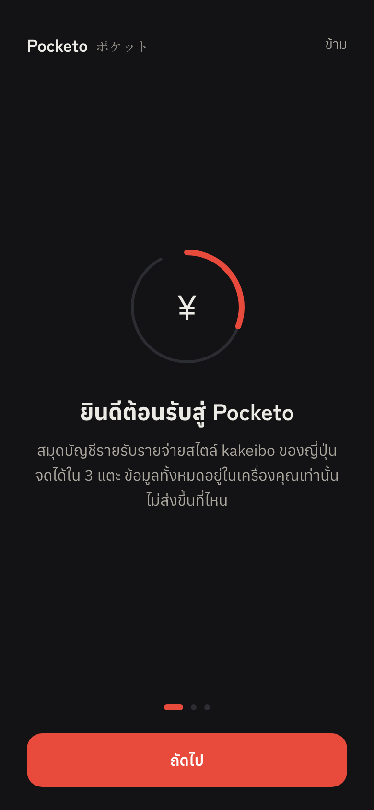

# Pocketo（ポケット）


Pocketo is a kakeibo (家計簿) income-and-expense tracker that runs entirely in the browser — no server, no account, no tracking. Log a transaction in 3 taps; split income into purpose-driven money pockets automatically; estimate Thai personal income tax bracket by bracket. Data lives in IndexedDB and never leaves the device.

**Live** — https://tasachii.github.io/Pocketo/ · **Repo** — https://github.com/Tasachii/pocketo · **Issues** — https://github.com/Tasachii/pocketo/issues

---

## Screenshots

| Home (dark) | Home (light) | Quick-add |
| --- | --- | --- |
|  |  |  |

| Reports | Pockets | Tax | Onboarding |
| --- | --- | --- | --- |
|  |  |  |  |

---

## What it is

Pocketo is a digital *kakeibo* — a Japanese-style household account book adapted for Thai users. It covers the full personal-finance loop: log income and spending, allocate incoming money into named pockets (savings, travel, investing), track per-category budgets, schedule recurring items (salary, rent, subscriptions), and estimate Thai income tax (bracket-by-bracket, with a "buy X more SSF/RMF, save Y" simulator).

It is a static web app: once loaded it works fully offline. Deletes are undo-able. Backups are portable JSON (optionally AES-GCM encrypted). The monthly summary exports as a shareable PNG card.

- **Stack** — React 18 · TypeScript (strict) · Vite 6 · Tailwind CSS · Dexie 4 (IndexedDB) · vite-plugin-pwa · Vitest · Playwright · axe-core
- No chart library, no UI kit — charts are hand-rolled SVG
- Fully bilingual (Thai / English), dark-first, installable offline PWA
- Money stored as integer satang; balances always derived from the transaction log

---

## Installation (use it as an app)

No build step needed — it is a web app. Open the URL, then install it to your home screen:

1. Open **https://tasachii.github.io/Pocketo/**
2. Install per platform:
   - **iPhone / iPad (Safari):** Share button → **Add to Home Screen**
   - **Android (Chrome):** ⋮ menu → **Install app**
   - **Desktop (Chrome / Edge):** install icon in the address bar
3. Optional but recommended: open **ตั้งค่า** (Settings) → request persistent storage, and export a JSON backup now and then.

---

## Running locally

**Requirements** — [Node 20+](https://nodejs.org) · Git

**Mac / Linux**
```bash
git clone https://github.com/Tasachii/pocketo.git
cd pocketo
npm install
npm run dev        # → http://localhost:5173/
```

**Windows**
```bat
git clone https://github.com/Tasachii/pocketo.git
cd pocketo
npm install
npm run dev        :: → http://localhost:5173/
```

---

## Running guide

```bash
npm run dev           # start Vite dev server on :5173
npm run build         # type-check (tsc --noEmit) + bundle to dist/
npm run preview       # serve the production build at :4173/Pocketo/
npm test              # unit tests (Vitest, 131 tests)
npm run test:coverage # unit tests + Istanbul coverage report
npm run test:e2e      # e2e + a11y (Playwright on chromium + webkit; first run: npx playwright install chromium webkit)
npm run lint          # ESLint --max-warnings 0
npm run icons         # regenerate PWA icons (zero-dependency PNG writer)
npm run og            # regenerate the Open Graph preview image
```

---

## Usage

**First launch.** A short onboarding walks through kakeibo, pockets, and tax. It only shows once; tap **ข้าม** to skip.

**Log an expense (3 taps).** Tap the vermilion **+** button → type the amount on the keypad → **ถัดไป** → tap a category. The entry saves instantly (red seal stamp confirms it). Note, date, and pocket are optional tweaks on the same screen.

**Log income.** Same flow, but switch the toggle to **รายรับ**. If you have auto-allocation rules, income is split into your pockets automatically.

**Pockets — กล่องเงิน tab.** Tap **เพิ่มกล่อง** to create a pocket; set a saving goal (shown as an ink-circle ring) and/or an auto-allocation percent (e.g. 20% of every income). Transfer between pockets with the ⇄ button.

**Budgets.** **ตั้งค่า** → tap a category → set a monthly budget. The **รายงาน** tab then shows a progress bar that turns amber at 80% and red past 100%.

**Recurring — รายการประจำ.** **ตั้งค่า** → **รายการประจำ** → add salary, rent, or subscriptions on a weekly / monthly / yearly schedule. Due items post automatically when you open the app; upcoming ones appear on the home screen.

**History & editing.** Home → **ทั้งหมด →** opens full history: search by category, note, amount, or pocket; tap any row to edit. Deleting shows a 5-second **เลิกทำ** (undo); deleting an auto-allocated income removes its linked transfers too, and undo restores the whole set.

**Tax — ภาษี tab.** Pull your logged yearly income with one tap (or type it), add withholding tax and deductions — caps are enforced and explained — and read the bracket-by-bracket result, refund/amount due, and marginal savings for extra deductions.

**Reports & sharing — รายงาน tab.** Browse months with ◀ ▶; the share icon renders the month (net, top categories, kakeibo pillars) into a PNG card you can share or download.

**Backup.** **ตั้งค่า** → export writes a JSON file (optional AES-GCM password). Import replaces everything with confirmation. A banner reminds you if you haven't exported for 30 days.

**Theme.** The icon at the top-right of **หน้าแรก** cycles dark → light → system. Dark is the default.

**Language.** Switch in **ตั้งค่า** → Language, or from the toggle on the welcome screen. Dates and the tax year follow the locale (Buddhist era in Thai, Gregorian in English).

---

## Architecture

| Topic | Decision |
| --- | --- |
| Storage | IndexedDB via Dexie — survives tab close, holds thousands of rows, works offline. Preferences (theme, last export date) go to `localStorage`. No backend. |
| Money precision | Integer satang (1 THB = 100 satang) throughout `src/core/money.ts` — eliminates float drift on all arithmetic. |
| Derived balances | No stored balance field. Every balance is computed from the transaction log, so the log is the single source of truth. |
| Core / DB / UI split | Correctness-critical logic lives in pure functions in `src/core/` (money, tax, allocation, recurring, backup, crypto) with colocated `.test.ts` files. Database writes are in `src/db/`. React components in `src/components/` and `src/screens/` call those layers; they contain no money math. |
| Charts | Hand-rolled SVG (`src/components/Donut.tsx` is the model) — no chart library dependency. |
| Routing | No router — the app is a single-page shell; screens are state-driven. Hash routing not needed because GitHub Pages serves the single HTML file. |
| Base path | `/Pocketo/` (capital P) in production (`vite.config.ts` `base`). The CI `check-base` step guards this after every build. |
| PWA / offline | `vite-plugin-pwa` with Workbox runtime caching for Google Fonts (StaleWhileRevalidate for stylesheets, CacheFirst for font files). SW is blocked during e2e runs to avoid flaky reload assertions. |
| Encryption | AES-GCM via the Web Crypto API (`src/core/crypto.ts`) — no third-party crypto dependency. |
| Accessibility | axe-core audit via `@axe-core/playwright` runs against every main screen in both dark and light themes on every CI push. One documented brand-accent (vermilion #d9402f) is a known exception below 4.5:1 body-text contrast; it clears the 3:1 UI-component threshold. |
| Security | CSP in `index.html` (`script-src 'self'`, no `eval`). 0 `npm audit` vulnerabilities. |
| i18n | `src/i18n/th.ts` · `src/i18n/en.ts` + `useT()` hook. No runtime i18n library. |

---

## Testing

| Layer | Tool | Count | Browsers |
| --- | --- | --- | --- |
| Unit (pure core + DB) | Vitest + fake-indexeddb | 131 tests | Node |
| E2E + accessibility | Playwright + axe-core | 14 tests | Chromium + WebKit (mobile 390×844) |

Coverage thresholds (Istanbul, CI-gated): lines ≥ 75%, branches ≥ 70%, functions ≥ 80%. Pure math modules (`src/core/{allocate,money,tax,recurring,crypto}.ts`) are held to lines ≥ 95%, functions 100%.

---

## Privacy

No server. No account. No analytics. All transactions, pockets, budgets, and recurring rules live in **IndexedDB** on your device. Preferences live in **localStorage**. The only third-party network request is Google Fonts (loaded on first visit, then cached for offline use). See [PRIVACY.md](PRIVACY.md) for the full policy.

> **Your data lives only on this device.** Browsers can evict local storage for sites left unused for a long time. Install the app, grant persistent storage in **ตั้งค่า**, and export a JSON backup periodically.

---

## Roadmap

Near-term (ready to start):

- [ ] Scope `History` and `Home` queries to avoid loading the full transaction table on first paint (performance at 10k+ rows)
- [ ] Recurring rules: optional end date + "every N" interval
- [ ] Local reminders — on-open nudges for due recurring items and budget overruns (Notification API, opt-in)

Mid-term:

- [ ] Opt-in cross-device sync (needs a backend decision first — recommended Supabase; local-first core stays untouched)
- [ ] Bank-statement CSV import with column mapping and duplicate detection
- [ ] Tax engine phase 2: family allowances (spouse, children, parents), Easy-E-Receipt, income types beyond 40(1)

Long-term / nice-to-have:

- [ ] More report views — net-worth-over-time line, cash-flow forecast, category trends
- [ ] High-contrast / larger-text accessibility mode
- [ ] Privacy-respecting usage counter (GoatCounter/Plausible, opt-in, no PII — needs owner decision)
- [ ] Custom domain

Already shipped (v0.1): income/expense logging, pockets with auto-allocation, kakeibo reports, per-category budgets, recurring (weekly/monthly/yearly with catch-up), Thai tax estimator 40(1), searchable history with edit/undo, encrypted JSON backup, onboarding, dark/light/system themes (WCAG AA), bilingual Thai/English, installable offline PWA, OG preview, CI + auto-deploy.

See [ROADMAP.md](ROADMAP.md) for full detail, effort estimates, and acceptance criteria. See [CONTRIBUTING.md](CONTRIBUTING.md) for conventions before changing code.

---

## Other docs

| File | Contents |
| --- | --- |
| [PROJECT_GUIDE.md](PROJECT_GUIDE.md) | How the code works, file by file |
| [CONTRIBUTING.md](CONTRIBUTING.md) | Conventions and gotchas — read before changing code |
| [DESCRIPTION.md](DESCRIPTION.md) | Concept and class diagram |
| [ROADMAP.md](ROADMAP.md) | What to build next |
| [PRIVACY.md](PRIVACY.md) | Full privacy policy |
| [CHANGELOG.md](CHANGELOG.md) | Release history |

---

## License

MIT © Phasathat Jaruchitsophon

Thai tax brackets and deduction caps follow the Revenue Department's published structure for tax year 2568. The tax screen is an estimate, not filing advice.
